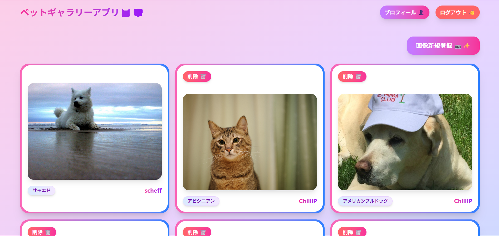

# ペットギャラリーアプリ

ペット愛好家のためのコミュニティ型画像ギャラリーアプリです。犬・猫の可愛い写真を投稿・共有し、AI 機能で品種を自動識別できる Flask ベースの Web アプリケーションです。

## 📸 アプリケーションプレビュー



*メイン機能:*
- コミュニティペットギャラリー（メインページ）
- ペット画像投稿フォーム
- AI 品種識別結果表示
- ユーザー登録・ログインページ

## 機能

### 主要機能

- **コミュニティギャラリー**: 全ユーザーの投稿したペット画像を閲覧・共有
- **画像投稿**: 愛犬・愛猫の写真をアップロード（PNG・JPG 対応）
- **AI 品種識別**: 投稿した画像から 47 種類の犬・猫品種を自動識別
- **信頼度表示**: AI 予測の確率スコアを表示
- **個人管理**: 自分の投稿画像の削除・管理

### ユーザー管理

- **ユーザー登録・認証機能**: 安全なアカウント作成とログイン
- **ロールベースアクセス制御**: 管理者とユーザーの権限分離
- **プロフィール管理**: ユーザー自身の情報編集・更新
- **管理者機能**: ユーザー管理・CRUD 操作（管理者のみ）

### 技術的機能

- **コミュニティ画像ギャラリーシステム**: 全ユーザー画像の一覧表示
- **安全な画像アップロード**: UUID 基盤ファイル名による衝突回避
- **AI 品種識別用 RESTful API**: セキュアな API キー認証
- **ロールベースアクセス制御**: 管理者・ユーザー権限管理
- **データベース設計**: SQLite + マイグレーション管理
- **レスポンシブ UI**: Tailwind CSS による現代的デザイン
- **セキュリティ**: CSRF 保護・セッション管理・権限チェック
- **包括的ログシステム**: アプリケーション動作の記録

## 技術スタック

### バックエンド

- **Flask 2.3.3** - Web フレームワーク
- **SQLAlchemy** - データベース ORM
- **Flask-Login** - ユーザーセッション管理
- **Flask-Migrate** - データベースマイグレーション
- **Flask-WTF** - フォーム処理・CSRF 保護

### 機械学習

- **TensorFlow 2.10+** - 深層学習フレームワーク
- **OpenCV** - 画像処理
- **MobileNetV3** - ベースモデルアーキテクチャ
- **カスタムファインチューニングモデル** - 47 品種分類

### フロントエンド

- **Tailwind CSS 4.1.11** - スタイリングフレームワーク
- **Jinja2 テンプレート** - サーバーサイドレンダリング
- **JavaScript** - クライアントサイドインタラクション

### データベース

- **SQLite** - ローカルデータベース
- **Alembic** - マイグレーション管理

## 対応品種

### 猫品種 (12 種類)

アビシニアン, ベンガル, バーマン, ボンベイ, ブリティッシュショートヘア, エジプシャンマウ, メインクーン, ペルシャ, ラグドール, ロシアンブルー, シャム, スフィンクス

### 犬品種 (35 種類)

アメリカンブルドッグ, ピットブル, バセットハウンド, ビーグル, ボクサー, チワワ, イングリッシュコッカー, イングリッシュセッター, ジャーマンショートヘアードポインター, グレートピレニーズ, ハバニーズ, 狆, キースホンド, レオンベルガー, ミニチュアピンシャー, ニューファンドランド, ポメラニアン, パグ, セントバーナード, サモエド, スコッチテリア, 柴犬, スタッフォードシャーブルテリア, ウィートンテリア, ヨークシャーテリア など

## インストール

### 前提条件

- **Python 3.8 ～ 3.12** (⚠️ **Python 3.13 は TensorFlow と互換性がないため使用不可**)
- Node.js (Tailwind CSS 用)
- Git

### 1. リポジトリのクローン

```bash
git clone <repository-url>
cd dcc_app
```

### 2. Python 環境のセットアップ

```bash
# 仮想環境の作成
python -m venv env312
# 仮想環境の有効化
# Windows:
env312\Scripts\activate
# macOS/Linux:
source env312/bin/activate
```

### 3. Python 依存関係のインストール

```bash
pip install -r requirements.txt
```

### 4. Node.js 依存関係のインストール

```bash
npm install
```

### 5. 環境変数の設定

ルートディレクトリに`.env`ファイルを作成し、以下の内容をコピーして適切な値に変更してください：

```env
# Flask設定
FLASK_APP=apps.app:create_app('local')
FLASK_ENV=development
# 重要: 本番環境では長くて推測困難な文字列に変更してください
SECRET_KEY=your-very-long-random-secret-key-change-this-in-production

# API設定
# 重要: セキュリティのため、本番環境では強力なAPIキーに変更してください
API_KEY=dev-api-key-12345-change-this-immediately
API_BASE_URL=http://localhost:5001

# データベース設定
DATABASE_URL=sqlite:///local.sqlite

# ファイルアップロード設定
UPLOAD_FOLDER=apps/images
```

#### 環境変数の説明：

- **SECRET_KEY**: Flask セッションの暗号化に使用。本番環境では`python -c "import secrets; print(secrets.token_hex(32))"`で生成した値を使用
- **API_KEY**: 画像分類 API の認証キー。Web アプリと API サーバー間の通信を保護
- **API_BASE_URL**: 画像分類 API サーバーの URL（通常は localhost:5001）
- **UPLOAD_FOLDER**: アップロードされた画像の保存先ディレクトリ
- **DATABASE_URL**: データベース接続文字列（SQLite 使用）

#### セキュリティ重要事項：

⚠️ **本番環境では必ず以下を変更してください**：

- `SECRET_KEY`を長いランダム文字列に変更
- `API_KEY`を強力で推測困難な値に変更
- `.env`ファイルを`.gitignore`に追加（機密情報の漏洩防止）

### 6. データベースの初期化

```bash
# マイグレーションリポジトリの初期化（存在しない場合）
flask db init

# マイグレーションの作成
flask db migrate -m "Initial migration"

# マイグレーションの適用
flask db upgrade
```

### 7. 管理者ユーザーの作成

```bash
# 管理者ユーザー作成スクリプトを実行
python create_admin_simple.py
```

管理者アカウントが作成されます。このアカウントでユーザー管理機能にアクセスできます。

### 8. CSS のビルド（開発環境）

```bash
# CSS を一度ビルド
npm run build-css

# 変更を監視（開発時推奨）
npm run watch-css
```

## アプリケーションの実行

### 1. 分類 API サーバーの起動

```bash
cd api
python api_app.py
```

API サーバーは `http://localhost:5001` で起動します

### 2. Web アプリケーションの起動

```bash
# メインディレクトリで
flask run
```

Web アプリケーションは `http://localhost:5000` で起動します

### 3. アプリケーションへのアクセス

- **Web インターフェース**: http://localhost:5000
- **API ヘルスチェック**: http://localhost:5001/health

## ユーザーロールと機能

### 👤 **一般ユーザー**
- **ログイン後のリダイレクト**: ペットギャラリー（メインページ）
- **利用可能機能**:
  - ペット画像の投稿とAI品種識別
  - コミュニティギャラリーの閲覧
  - 自分の投稿画像の削除
  - プロフィール管理（自分のみ）

### 🛡️ **管理者ユーザー**
- **ログイン後のリダイレクト**: ペットギャラリー（一般ユーザーと同じ）
- **利用可能機能**:
  - 一般ユーザーの全機能
  - 全ユーザーの管理（作成・編集・削除）
  - ユーザーロールの変更
  - システム全体の管理
- **管理機能アクセス**: ナビゲーションバーの「管理 🛡️」ボタンから

### 🔐 **セキュリティ機能**
- **権限分離**: 管理機能は管理者のみアクセス可能
- **自己保護**: 管理者は自分自身を削除できない
- **個人情報保護**: ユーザーは自分の情報のみ編集可能
- **セッション管理**: 安全なログイン・ログアウト

## API ドキュメント

### ベース URL

```
http://localhost:5001
```

### 認証

全ての API エンドポイントは`X-API-Key`ヘッダーで API キーを渡す必要があります。

### エンドポイント

#### ヘルスチェック

```http
GET /health
```

**レスポンス:**

```json
{
  "status": "healthy",
  "message": "API is running"
}
```

#### 画像分類

```http
POST /predict
```

**ヘッダー:**

```
X-API-Key: your-api-key-here
Content-Type: multipart/form-data
```

**リクエストボディ:**

- `image`: 画像ファイル（PNG/JPG）

**レスポンス:**

```json
{
  "predicted_class": "柴犬",
  "probabilities": {
    "柴犬": 0.8845,
    "キースホンド": 0.0654,
    "サモエド": 0.0234,
    "...": "..."
  }
}
```

**エラーレスポンス:**

```json
{
  "error": "No image file provided"
}
```

## モデル情報

### アーキテクチャ

- **ベースモデル**: MobileNetV3（事前学習済み）
- **ファインチューニング**: 犬・猫品種データセットでカスタム学習
- **入力サイズ**: 160x160 ピクセル
- **クラス数**: 47 品種
- **モデルファイル**: `dog_cat_classification_fine_tuned_e30.keras`

### パフォーマンス

- 学習エポック数: 30
- 画像前処理: MobileNetV3 標準前処理
- 出力: 全 47 クラスの Softmax 確率

### 使用方法

モデルは以下の処理で画像を処理します:

1. 160x160 ピクセルにリサイズ
2. 色空間変換（BGR → RGB）
3. MobileNetV3 前処理
4. バッチ予測
5. Softmax 確率出力

## プロジェクト構造

```
dcc_app/
├── api/                          # 分類API
│   ├── api.py                   # Flask APIサーバー
│   └── dog_cat_classification_fine_tuned_e30.keras
├── apps/                        # メインWebアプリケーション
│   ├── app.py                   # Flaskアプリファクトリ
│   ├── config.py                # 設定（ロールベース認証含む）
│   ├── auth/                    # 認証モジュール
│   │   ├── forms.py             # ログイン・登録フォーム
│   │   ├── views.py             # 認証ロジック
│   │   └── templates/           # 認証テンプレート
│   ├── classifier/              # 画像分類モジュール
│   │   ├── forms.py             # 画像アップロードフォーム
│   │   ├── models.py            # 画像・タグモデル
│   │   ├── views.py             # ギャラリー・アップロード機能
│   │   └── templates/           # ギャラリーテンプレート
│   ├── crud/                    # ユーザー管理モジュール
│   │   ├── forms.py             # ユーザー管理フォーム
│   │   ├── models.py            # ユーザーモデル（ロール機能含む）
│   │   ├── views.py             # 管理者・プロフィール機能
│   │   └── templates/           # 管理・プロフィールテンプレート
│   ├── images/                  # アップロード画像保存場所
│   └── static/                  # 静的アセット
├── migrations/                   # データベースマイグレーション
├── static/                      # グローバル静的ファイル
├── create_admin_simple.py        # 管理者ユーザー作成スクリプト
├── requirements.txt             # Python依存関係
├── package.json                 # Node.js依存関係
├── .env.example                 # 環境変数設定例
└── local.sqlite                # SQLiteデータベース
```

## 開発

### CSS 開発

```bash
# 開発中のCSS変更を監視
npm run watch-css
```

### データベースマイグレーション

```bash
# 新しいマイグレーションの作成
flask db migrate -m "変更の説明"

# マイグレーションの適用
flask db upgrade

# マイグレーションのダウングレード
flask db downgrade
```

### 管理者ユーザー管理

```bash
# 管理者ユーザー作成
python create_admin_simple.py

# 既存ユーザーを管理者に変更（Flask shell）
flask shell
>>> from apps.crud.models import User
>>> user = User.query.filter_by(email='user@example.com').first()
>>> user.role = 'admin'
>>> db.session.commit()
```

### ログ

アプリケーションログは`logs/dcc_app.log`にローテーション付きで保存されます。

## トラブルシューティング

### よくある問題

1. **TensorFlow 関連エラー**

   - **Python 3.13 を使用している場合**: Python 3.12 以下にダウングレードしてください
   - パッケージの互換性エラーが発生した場合は仮想環境を再作成してください

2. **API 接続失敗**

   - API サーバーがポート 5001 で動作していることを確認
   - 環境変数の API_KEY を確認

3. **データベースエラー**

   - `flask db upgrade`を実行してマイグレーションを適用
   - データベースファイルの権限を確認

4. **画像アップロード失敗**

   - UPLOAD_FOLDER が存在し書き込み可能であることを確認
   - ファイルサイズと形式を確認（PNG/JPG のみ）

5. **CSS 読み込み失敗**
   - `npm run build-css`を実行して CSS を生成
   - テンプレート内の静的ファイルパスを確認

6. **ユーザー権限エラー**
   - 管理機能にアクセスできない場合、ユーザーロールを確認
   - `python create_admin_simple.py`で管理者ユーザーを作成
   - 既存ユーザーの権限変更は Flask shell で実行

7. **データベース権限エラー**
   - `local.sqlite`ファイルの読み書き権限を確認
   - マイグレーション失敗時は `python create_admin_simple.py` を使用

### 環境設定チェックリスト

- Python 仮想環境が有効化されていることを確認
- `.env`ファイルが作成され、全ての環境変数が設定されていることを確認
- `SECRET_KEY`と`API_KEY`がデフォルト値から変更されていることを確認
- `apps/images`ディレクトリが存在し、書き込み権限があることを確認
- OS に応じてファイルパスが正しいことを確認

### 環境変数のテスト

設定が正しいかテストするには：

```bash
# Flaskアプリが起動できるかテスト
flask --version

# 環境変数が読み込まれているかテスト
python -c "from dotenv import load_dotenv; load_dotenv(); import os; print('SECRET_KEY:', os.getenv('SECRET_KEY')[:10] + '...' if os.getenv('SECRET_KEY') else 'Not set')"
```
